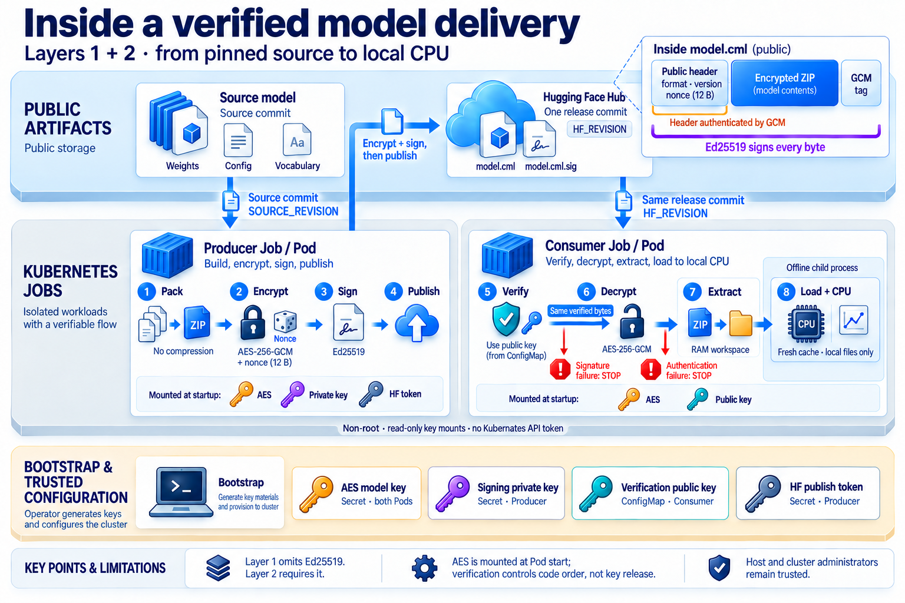

# Confidential ML Model Distribution PoC

Publish an encrypted machine-learning model to Hugging Face Hub, then download,
decrypt and load it in Kubernetes. A **Producer** Job packages a small BERT model
and publishes the ciphertext. A separate **Consumer** Job retrieves that exact
release, loads the decrypted local files and runs a small CPU check. Both jobs
finish after reporting their result; this PoC does not serve an inference API.

The source model is public. This demonstrates secure delivery of a packaged copy,
not secrecy of the original weights.

## Capabilities and scope

The layer numbers identify the assessment's three capabilities. The instructions
below are self-contained; the original assignment is not needed to run them.

| Capability | What it implements | How to run and verify |
|---|---|---|
| **Encrypted model delivery (Layer 1, required)** | AES-256-GCM encryption, public Hub publication and a Consumer that reads its AES key from a Kubernetes Secret. | [Base demo](#4-run-encrypted-model-delivery-layer-1): model loads; wrong AES key fails. |
| **Producer signature verification (Layer 2, optional)** | Ed25519 signature published with the ciphertext; Consumer verifies it using a controlled public key before decryption. | [Signed demo](#5-optional-verify-producer-signatures-layer-2): valid signature loads; wrong public key fails before decryption. |
| **Attested key release (Layer 3, optional development lab)** | Consumer requests its AES key through Confidential Data Hub (CDH) and Trustee Key Broker Service (KBS), using sample attestation instead of an AES Secret mount. | [Separate Linux lab](docs/layer3.md): allowed requests load; a denied request stops without loading. |

Start with Layer 1. Layer 2 uses the same local cluster; Layer 3 requires a separate
compatible Linux environment and can run with or without Layer 2. Sample
attestation demonstrates the integration, not hardware-backed protection from
the host. Only Layer 1 is required by the assessment.

**Verified:** Layers 1 and 2 ran end to end on local kind / Linux ARM64. The
development Layer 3 lab loaded the same real model through Kata/CDH/Trustee on
Linux AMD64 and rejected a fresh Consumer under deny-all. See
[observed results and verification limits](#observed-results).

[Run the demo](#run-the-demo) · [Tests](#tests-and-observed-results) ·
[Design and security](docs/design.md) · [Optional local checks](docs/local-checks.md)

## Architecture



The local bootstrap script, [`scripts/run_layer1.py`](scripts/run_layer1.py),
orchestrates either mode: it generates keys, provisions Secrets and ConfigMaps,
starts Producer, and passes the published commit to Consumer.
Producer and Consumer are separate Jobs: each creates a Pod, runs Python and exits.
Neither workload uses the Kubernetes API. Consumer receives the AES key and, in Layer 2,
a controlled public key. Only Producer receives the Hub token and, in Layer 2,
the signing private key.

Layer 2 verifies the exact bytes it later decrypts. Its AES key file is already mounted
at Pod startup: verification controls program order, not key release. The loader
then uses the extracted folder, an empty cache, and offline settings in a child
process. Host and cluster administrators remain trusted.

<details>
<summary>Optional Layer 3: controlled key release in the development lab</summary>

[](docs/architecture-layer3.png)

The Consumer requests its AES key through the Confidential Data Hub (CDH) and
Trustee Key Broker Service (KBS), with no AES Secret mount or Secret fallback.
The diagram summarizes the flow; bounded extraction happens before local loading.
Sample attestation is a software-generated development check, not hardware-backed
proof of a trustworthy environment. The host remains trusted.

See the [Layer 3 lab guide](docs/layer3.md) for the pinned stack, reproduction
commands and observed allow/deny results.

</details>

## Prerequisites

The commands below assume a POSIX shell and a local Docker engine. The complete
route was tested on macOS ARM64 with Docker Desktop. Both images also built on a
fresh Linux AMD64 CI runner; the separate Layer 3 Consumer ran on an AMD64 VM.
The entire Producer/bootstrap route has not been repeated on AMD64. Use the same
terminal throughout so exported variables remain available.

The host dependency installation also installs PyTorch: the locked wheels require
**macOS 14+ on Apple Silicon**, or **Linux ARM64/AMD64 with glibc 2.28+**. Intel
macOS and Alpine/musl are not supported by this host setup. Package compatibility
does not mean the complete demo has been exercised on every supported platform.

| Tool / access | Tested requirement |
|---|---|
| Python and uv | Python **3.12.14** installed as `python3.12`; uv **0.8.17** |
| Container tooling | Working Docker Engine **29.1.3**; kind **v0.33.0**; kubectl **v1.34.1** |
| Kubernetes | Local cluster created below; node **v1.34.11**, pinned by digest |
| Other commands | Git; curl and shasum for the macOS kind installation |
| Hugging Face | Personal account and a token allowed to create/write your public test model repository |
| Network | HTTPS access to Hugging Face, package indexes and container registries |

Follow [tool setup](docs/setup.md) if anything is missing. Python installation is
an explicit prerequisite: the pinned older uv cannot download this Python patch
itself. No cloud subscription, container registry push or GPU is required.

## Run the demo

For the required demo, complete steps 1–4, then go to step 6. Step 5 adds optional
Producer signature verification.

### 1. Clone and install dependencies

Run all subsequent commands from this repository's root. `$HOME` means your own
home directory; no personal absolute paths are embedded in the commands.

```bash
git clone https://github.com/adeavid/confidential-ml-distribution.git
cd confidential-ml-distribution
python3.12 --version
uv --version
uv sync --frozen --python python3.12
```

Direct dependency versions and the resolved environment are pinned in
`pyproject.toml` and `uv.lock`. Linux selects CPU-only PyTorch.
The Kubernetes demo downloads its own model; no standalone local demo is required.

### 2. Create the local cluster

Start Docker first. On the tested macOS setup use `open -a Docker` and
`export DOCKER_CONTEXT=desktop-linux`; wait until `docker info` succeeds.
On Linux, use your intended local Docker context instead. See [setup](docs/setup.md).

```bash
docker info --format 'os={{.OSType}} arch={{.Architecture}}'
kind version
kubectl version --client
umask 077
export MODEL_DEMO_KUBECONFIG="$HOME/.config/confidential-ml-distribution/kubeconfig"
mkdir -p "$(dirname "$MODEL_DEMO_KUBECONFIG")"
KIND_EXPERIMENTAL_PROVIDER=docker kind create cluster \
  --name model-demo --config k8s/kind.yaml \
  --kubeconfig "$MODEL_DEMO_KUBECONFIG" --wait 180s
kubectl --kubeconfig "$MODEL_DEMO_KUBECONFIG" --context kind-model-demo \
  wait --for=condition=Ready node --all --timeout=120s
kubectl --kubeconfig "$MODEL_DEMO_KUBECONFIG" --context kind-model-demo \
  wait --for=condition=Ready pod --all --all-namespaces --timeout=120s
```

The API binds to loopback. The separate kubeconfig avoids replacing your default
context. If this cluster already exists, inspect it instead of recreating it.

### 3. Build and load the images

```bash
docker build -f Dockerfile.producer -t model-producer:layer1 .
docker build -f Dockerfile.consumer -t model-consumer:layer1 .
KIND_EXPERIMENTAL_PROVIDER=docker kind load docker-image \
  model-producer:layer1 model-consumer:layer1 --name model-demo
```

Both Dockerfiles pin their Python/uv base images by digest. Build for the same
platform as the kind node. Jobs use `imagePullPolicy: Never`, so images must be
loaded into kind. Rebuild and reload after application changes.

### 4. Run encrypted model delivery (Layer 1)

This performs a **real publication** to your own public Hugging Face model repo.
Replace `<your-user>` below with your personal account, not an organization.
Producer creates the repo if needed. Use a dedicated test repo: no README/model
card or unrelated files; only `.gitattributes`, `model.cml` and `model.cml.sig`
are permitted. Enter your token only into the local login prompt.

```bash
uv run --frozen hf auth login --format human --no-add-to-git-credential
export MODEL_DEMO_HF_REPO="<your-user>/confidential-ml-artifacts"
uv run --frozen python scripts/run_layer1.py \
  --repo "$MODEL_DEMO_HF_REPO" --kubeconfig "$MODEL_DEMO_KUBECONFIG" \
  --context kind-model-demo --verify-wrong-key
```

Expected: Producer and Consumer exit **0**; Consumer reports `status: loaded`,
`device: cpu`, `finite_output: true`, and the published full revision.
The additional `consumer-wrong-key` Job must exit **1** without loading.
That expected negative result does not make the bootstrap command fail.

Bootstrap creates a fresh namespace and provisions immutable Secrets from the
checked-in templates. Do not apply the empty Secret templates directly. Keys and
tokens are supplied through stdin to kubectl, not embedded in versioned YAML,
images, process arguments or logs. AES backups are stored outside the repo under
`$HOME/.config/confidential-ml-distribution/runs/<namespace>/model.key` (`0600`).

### 5. Optional: verify Producer signatures (Layer 2)

**Optional: add Producer signature verification.** For the required encrypted
delivery demo only, skip to [inspection and cleanup](#6-inspect-and-clean-up).

Use the same setup, account and variables. Layer 2 can also run directly after
setup; a completed Layer 1 run is not a prerequisite. Separate tags make each
manifest's intended mode visible.

```bash
docker build -f Dockerfile.producer -t model-producer:layer2 .
docker build -f Dockerfile.consumer -t model-consumer:layer2 .
KIND_EXPERIMENTAL_PROVIDER=docker kind load docker-image \
  model-producer:layer2 model-consumer:layer2 --name model-demo
uv run --frozen python scripts/run_layer1.py \
  --layer 2 --repo "$MODEL_DEMO_HF_REPO" --kubeconfig "$MODEL_DEMO_KUBECONFIG" \
  --context kind-model-demo --verify-wrong-key --verify-wrong-public-key
```

Expected: the successful Consumer additionally reports `signature_verified: true`.
The wrong-public-key Job fails at signature verification; the wrong-AES Job fails
at GCM authentication. Both exit **1** without a loaded-model report. Artifact and
signature are published together and retrieved from the same full commit.

Bootstrap creates a fresh Ed25519 pair and supplies the public key through a
controlled ConfigMap, independently of the Hub. The private backup is
`$HOME/.config/confidential-ml-distribution/runs/<namespace>/producer-signing.pem`.
Consumer knows the AES key and could create another valid GCM ciphertext; it
cannot create the Producer's signature without the separate signing private key.
Bootstrap attempts to remove temporary signing/token Secrets after Producer,
including caught failures. After an abrupt interruption or API outage, finish
cleanup using the run's namespace below. Deleting a Secret does not revoke an
already copied credential. Layer 2 never falls back to Layer 1.

### 6. Inspect and clean up

Copy `namespace` from the bootstrap output. Each run has a different namespace.
Local reports include revisions, Pod UIDs, image IDs, exit codes and CPU results.
After a failure, `result.json` may be absent or partial; inspect the diagnostics
in [troubleshooting](#troubleshooting) before cleanup.

```bash
export MODEL_DEMO_RUN="<namespace-from-bootstrap>"
kubectl --kubeconfig "$MODEL_DEMO_KUBECONFIG" --context kind-model-demo \
  get jobs,pods -n "$MODEL_DEMO_RUN"
cat "runtime/$MODEL_DEMO_RUN/result.json"
```

After inspection, remove that run's Jobs, Secrets and temporary volumes:

```bash
kubectl --kubeconfig "$MODEL_DEMO_KUBECONFIG" --context kind-model-demo \
  delete namespace "$MODEL_DEMO_RUN" --wait=true
```

The public Hub revision, local report, protected key backup and local Hugging Face
login remain. Preserve matching keys if you need to consume that revision again.
When finished with the demo, `uv run --frozen hf auth logout --token-name <demo-token-name>`
removes that saved login locally. Revoke a dedicated demo token in Hugging Face
settings if it should no longer authorize publication; local logout does not
revoke the token. For full cluster cleanup:

```bash
KIND_EXPERIMENTAL_PROVIDER=docker kind delete cluster \
  --name model-demo --kubeconfig "$MODEL_DEMO_KUBECONFIG"
```

## Tests and observed results

Fast tests use small fixtures and ephemeral keys, with no external services:

```bash
uv run --frozen pytest -q
```

Two real-model tests are opt-in. To include them, download the pinned source once:

```bash
uv run --frozen python src/model_demo.py download runtime/source-model
MODEL_DEMO_TEST_MODEL=runtime/source-model uv run --frozen pytest -q
```

Use a new destination for downloads; reuse the existing complete folder for tests.
The opt-in tests load in new processes with empty caches and a Python socket guard.
For a separate load-only check with container networking disabled, see
[local checks](docs/local-checks.md#load-with-docker-networking-disabled).

### Observed results

On **2026-09-18**, the full suite with both real-model tests was rerun using the
existing pinned local model: **240 passed in 17.31 s**, including offline CDH and
evidence-verifier checks. This is an observed duration, not a runtime guarantee.
CDH fixtures do not prove attestation. The following real Hub/Kubernetes runs
were completed on **2026-09-17** in a fresh local kind cluster; the local test
rerun did not repeat publication or cluster deployment:

| Layer | Namespace | Published revision | Result |
|---|---|---|---|
| 1 | `model-demo-l1-4307c63d` | [`50fc2f58f73427e2da8f99e1adebd05738e5f0b3`](https://huggingface.co/adeavid/confidential-ml-artifacts/tree/50fc2f58f73427e2da8f99e1adebd05738e5f0b3) | Producer/Consumer exit 0; wrong AES exits 1. |
| 2 | `model-demo-l2-4a883a84` | [`83612572c07e98c4167b37d2897e4bf1863ac976`](https://huggingface.co/adeavid/confidential-ml-artifacts/tree/83612572c07e98c4167b37d2897e4bf1863ac976) | Signature verified and model loaded; wrong AES/public key exit 1. |

A separate copy containing only tracked files installed the frozen dependencies
in a new virtual environment and passed the default suite: **238 passed, 2 opt-in
model tests skipped**. This check reused the local package cache on the same host;
no downloaded model, keys or runtime reports were copied into that checkout.

The separate Linux AMD64 Layer 3 lab reused the Layer 2 artifact and matching AES
key. Fresh Kata Jobs passed without a signature requirement and with signature
verification (exit 0); another signed Job failed at CDH under deny-all (exit 1,
no load). None mounted an AES Secret. See [commands and evidence](docs/layer3.md#observed-results).

Both successful Consumers produced finite `[1, 9, 30522]` output on CPU from
4,433,468 parameters. Anonymous Hub inspection found only the intended files.
Application images had previously built from an isolated checkout using Docker's
layer cache; the new-cluster runs reused those images with neutral tags.

| Acceptance property | Evidence |
|---|---|
| Secret delivery and fresh Kubernetes Consumer load | Real runs above; read-only mounts and non-root UID/GID checked. |
| Wrong AES, changed ciphertext/tag, truncation | Local fixtures and real artifact CLI checks; wrong AES also tested in Kubernetes. |
| Bad/missing signature or wrong public key stops before AES | Offline call-order tests; wrong public key also tested in Kubernetes. |
| Local files are sufficient; missing files cannot trigger fallback | Opt-in real-model loads with empty caches and Docker `--network none`; missing-file/no-fallback preflight fixtures. |
| Unsafe archive names, links, types and sizes rejected | Local package fixtures; no unsafe extraction paths accepted. |
| Container packaging and manifest validity | Both Dockerfiles built; base resource/workload templates passed API server dry-run; optional Kata Jobs executed on the lab cluster. |
| Optional KBS key release | Real unsigned/signed model loads and a fresh policy-denied Consumer; no Secret fallback. |

Missing/modified signatures were tested offline, not by corrupting public Hub
contents. Fixture tests are not integration evidence. The entire base demo has
not been repeated by a second person from a clean clone. The portable Layer 3
installer's parameterized form was reviewed, not rerun on a second fresh VM.

The [CI workflow](.github/workflows/consumer-image.yml) tests local fixtures and
builds both images on pull requests without user-provided secrets. Its first
[successful clean-runner execution](https://github.com/adeavid/confidential-ml-distribution/actions/runs/35253400653)
passed 221 tests with 2 opt-in model tests skipped, before the evidence-verifier
tests were added. Manual publication uses a separate package-write job and pins
the resulting public Consumer image by digest. These counts describe different
test revisions, not additional integration runs.

## Troubleshooting

| Symptom | Check / action |
|---|---|
| Docker unavailable | Start the intended engine; `docker info` must succeed before kind. |
| `ErrImageNeverPull` | Build and load the exact tag into this kind cluster. |
| Hub 401/403 or rejected repository | Check personal-account ownership, create/write permissions, and allowed repo files. |
| Authentication or signature failure | Stop; inspect the expected artifact revision and matching keys. Never bypass checks. |
| Existing output directory or namespace | Use a fresh run; never reuse private-key paths. |
| Interrupted publication / commit conflict | Inspect the Hub and retain the key before retrying; publication may already have succeeded. Once cluster access returns, stop the run's Producer and delete that run's namespace to remove remaining Secrets. |
| Pending Pod, deadline or missing `result.json` | Inspect the run's Jobs, Pods, events and saved logs below. Base Jobs have a 300-second deadline; bootstrap stops a Job if its 360-second wait expires. |
| Wrong cluster / empty kubeconfig argument | Re-export the README variables in this terminal and use explicit `kind-model-demo`. |
| Missing local model files | Treat as a failure; there is no original-model download fallback. |

For a failed run, set `MODEL_DEMO_RUN` to the namespace printed in the initial
`bootstrap` output, even if publication never completed:

```bash
kubectl --kubeconfig "$MODEL_DEMO_KUBECONFIG" --context kind-model-demo \
  get jobs,pods -n "$MODEL_DEMO_RUN"
kubectl --kubeconfig "$MODEL_DEMO_KUBECONFIG" --context kind-model-demo \
  get events -n "$MODEL_DEMO_RUN" --sort-by=.metadata.creationTimestamp
```

Inspect any saved `runtime/$MODEL_DEMO_RUN/*.log` files locally. A timed-out Job
may already have been deleted, so live Pod logs may no longer exist. Keep private
keys and token values out of diagnostic output shared with others. After an
interrupted run, stop any surviving Producer with:

```bash
kubectl --kubeconfig "$MODEL_DEMO_KUBECONFIG" --context kind-model-demo \
  delete job producer -n "$MODEL_DEMO_RUN" --ignore-not-found --wait=true
```

Then use the namespace cleanup above. Inspect the Hub before starting a new run;
do not assume a failed client operation means publication did not happen.

## Decisions and limitations

The selected source is [Google BERT Tiny at a fixed commit](https://huggingface.co/google/bert_uncased_L-2_H-128_A-2/tree/30b0a37ccaaa32f332884b96992754e246e48c5f),
with safetensors weights and an Apache-2.0 model card/license preserved in the
package. Its size makes CPU verification practical. Full-buffer AES-GCM, Ed25519,
Jobs, extraction bounds and alternatives are explained in [design](docs/design.md).

Kubernetes Secret base64 is not encryption. Privileged host/cluster administrators
can access keys or plaintext. A valid signature does not prove model safety or
freshness, and a pinned revision is not a complete anti-rollback system.
Memory-backed temporary storage does not guarantee secure memory erasure.

**Layer 3:** a separate disposable Linux AMD64 VM has passed real nested KVM,
Kata guest boot, full model loads through CDH/KBS, and policy rejection. See the separate
[development lab guide](docs/layer3.md) for the fixed historical stack,
reproduction steps and observed results. It retains the required CoCo operator.
Sample attestation demonstrates the protocol, not hardware-backed protection
from the host; this old Kubernetes baseline is not a production recommendation.

Production rotation/revocation, strict attestation policies and real confidential
hardware remain future work. References: [Kata prerequisites](https://github.com/kata-containers/kata-containers/blob/main/docs/quick-start-guide.md#try-it-out),
[assessment CoCo reference](https://confidentialcontainers.org/blog/2024/12/03/confidential-containers-without-confidential-hardware/),
[current CoCo installation](https://github.com/confidential-containers/charts/blob/main/QUICKSTART.md).
