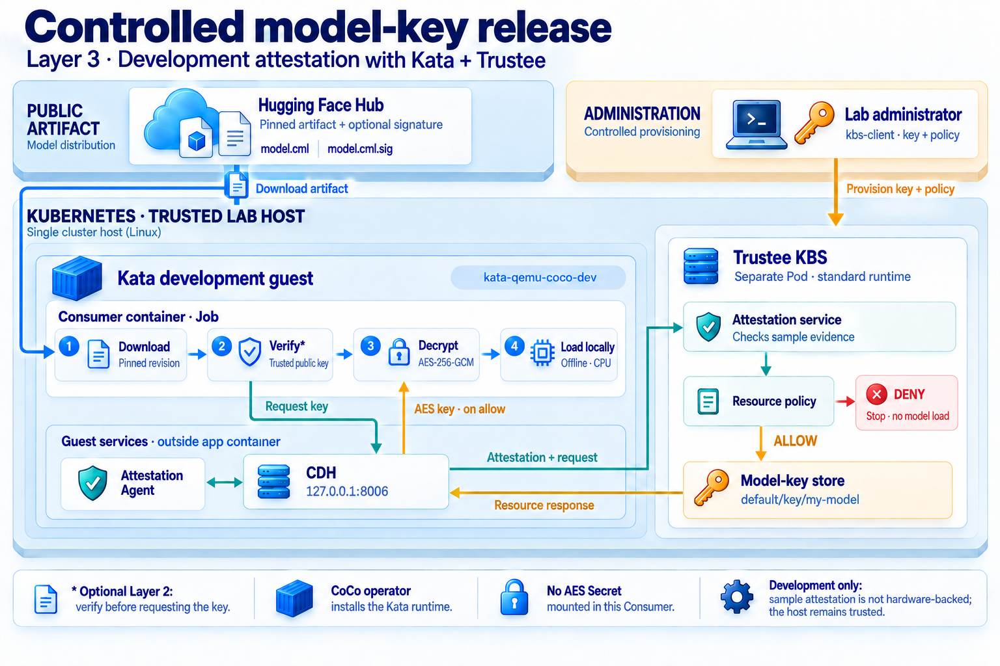

# Layer 3: development attestation lab

[Back to the project](../README.md)

**Status: verified in the development lab on 2026-09-17.** Fresh Kata Consumers
retrieved the correct AES key through CDH → attestation → Trustee KBS, decrypted
the Hub artifact and loaded the real model, with and without Layer 2 verification.
A fresh signed Consumer was denied under deny-all and exited without loading.
Layers 1 and 2 remain independently runnable through the main README.

## Architecture and scope

[](architecture-layer3.png)

**KBS** means Key Broker Service; **CDH** means Confidential Data Hub. The Kata
guest is a virtual machine containing the application container and separate
guest services. Layer 2 is optional; when enabled, signature verification runs
before the key request. Bounded extraction takes place between decryption and
local loading.

The Consumer obtains AES through CDH, without an AES Secret mount or a Secret
fallback. Trustee runs on the same trusted lab host and uses development HTTP.
Denying future requests cannot recall a key already released.

The [sample attester](https://github.com/confidential-containers/guest-components/blob/v0.10.0/attestation-agent/attester/src/sample/mod.rs)
generates evidence in software. The
[sample verifier](https://github.com/confidential-containers/trustee/blob/68607d4300dda5a8ae948e2562fd06d09cbd7eca/deps/verifier/src/sample/mod.rs)
checks its format and expected report data, without validating a hardware
signature. Our permissive resource policy accepts the resulting `tee: sample`
claim. This exercises the protocol and key-release rules; it does not prove
hardware isolation or that the Consumer runs an approved image.

## Tested version matrix

| Component | Tested version |
| --- | --- |
| Host | Ubuntu 22.04, Linux x86_64, Intel GCE N2 with nested virtualization |
| Kubernetes / kubeadm / kubelet / kubectl | 1.30.1 |
| containerd / runc | 1.7.22 / 1.1.14 |
| CNI plugins / Flannel | 1.5.1 / 0.19.1, Flannel CNI plugin 1.1.0 |
| CoCo operator | 0.10.0, commit `cb92e0f48ebdb9b4869ae88b9f22a669dc63eb32` |
| Kata deploy / runtime class | 3.9.0 / `kata-qemu-coco-dev` |
| Trustee KBS / kbs-client | 0.10.1, commit `68607d4300dda5a8ae948e2562fd06d09cbd7eca` |

The [operator's pinned overlay](https://github.com/confidential-containers/operator/blob/cb92e0f48ebdb9b4869ae88b9f22a669dc63eb32/config/samples/ccruntime/default/kustomization.yaml)
selects this Kata version, Nydus and guest-pull. The operator is retained as required
by the assessment. Manifests were rendered with Kustomize 5.7.1 and all active
image references replaced by verified Linux amd64 digests. The old GCR metrics
proxy is unavailable; the same v0.13.1 is pinned from the project's Quay registry,
following the [upstream migration notice](https://github.com/kubernetes-sigs/kubebuilder/discussions/3907).

**This is an isolated historical lab.** Kubernetes 1.30 is
[outside its maintenance period](https://kubernetes.io/releases/patch-releases/#non-active-branch-history).
Sample attestation and `kata-qemu-coco-dev` do not establish hardware-backed trust
against the host. KBS uses internal development HTTP: `insecure_http=true`, while
`insecure_api=false` retains signed administration requests. HTTP does not
authenticate the server or provide transport confidentiality. Do not expose the
API server or KBS publicly, or treat this setup as production infrastructure.

## 1. Prepare the disposable Linux node

Use an authorized disposable VM; [the optional GCE setup](layer3-cloud.md)
records the tested provisioning route. The Kubernetes commands below do not create
cloud resources. Use Ubuntu 22.04 x86_64 and working nested KVM. The full model
demo uses the tested **4-vCPU, 16-GiB host** to accommodate its larger Kata guest
and the cluster services. The [upstream minimum of 8 GB RAM and 2 vCPU](https://github.com/confidential-containers/operator/blob/cb92e0f48ebdb9b4869ae88b9f22a669dc63eb32/docs/INSTALL.md)
describes the CoCo runtime prerequisites. Allow disk space for the approximately
1 GB compressed Kata payload. A VM's CPU architecture alone does not establish
KVM support.

Keep SSH behind your controlled access path, attach no Google service account,
and allow necessary outbound DNS/HTTPS. The VPC and connected routes must not
overlap Pod `10.244.0.0/16` or Service `10.96.0.0/12`. Binding Kubernetes to an
internal address does not override a permissive cloud firewall or external-IP NAT.

On the fresh VM, from this repository's root, set **your own** values:

```bash
export NODE_INTERNAL_IP='<assigned-private-ipv4>'
export EXPECTED_GCE_PROJECT='<your-authorized-project>'
export EXPECTED_GCE_VM='<your-disposable-vm-name>'
sudo bash scripts/layer3/bootstrap-kubernetes.sh \
  "$NODE_INTERNAL_IP" "$EXPECTED_GCE_PROJECT" "$EXPECTED_GCE_VM"
```

The installer verifies VM identity and an actual `KVM_CREATE_VM`, then installs
the pinned Kubernetes/containerd stack and Flannel. It rejects an existing
installation. It does not install CoCo. Its OS prerequisite packages come from
Ubuntu's signed APT repositories; their patch versions are not locked.

Use a root shell on this disposable VM for the cluster administration commands
below; keep `/etc/kubernetes/admin.conf` protected and outside the repository:

```bash
sudo -s
export KUBECONFIG=/etc/kubernetes/admin.conf
kubectl get nodes -o wide
```

## 2. Install CoCo and boot a Kata guest

```bash
kubectl apply --server-side -f k8s/layer3/coco-operator-pinned.yaml
kubectl wait --for=condition=Established \
  crd/ccruntimes.confidentialcontainers.org --timeout=120s
kubectl -n confidential-containers-system rollout status \
  deployment/cc-operator-controller-manager --timeout=300s
kubectl apply --server-side -f k8s/layer3/coco-runtime-pinned.yaml
kubectl -n confidential-containers-system get pods -o wide
kubectl get ccruntime ccruntime-sample -o yaml
```

Wait for installation to finish, including its containerd restart. Confirm the
runtime label and Ready node before creating the smoke Pod:

```bash
kubectl wait node/model-demo-l3 \
  --for=jsonpath='{.metadata.labels.katacontainers\.io/kata-runtime}'=true \
  --timeout=600s
kubectl wait node/model-demo-l3 --for=condition=Ready --timeout=300s
kubectl get runtimeclass kata-qemu-coco-dev
test -S /run/containerd-nydus/containerd-nydus-grpc.sock
kubectl apply -f k8s/layer3/kata-smoke-pinned.yaml
kubectl -n model-demo-l3-lab wait --for=condition=Ready pod/kata-smoke --timeout=300s
kubectl -n model-demo-l3-lab logs kata-smoke
pgrep -af qemu-system
kubectl -n model-demo-l3-lab wait \
  --for=jsonpath='{.status.phase}'=Succeeded pod/kata-smoke --timeout=120s
```

Server-side apply avoids exceeding the large CRD's client-side annotation limit.
The smoke sleeps for 60 seconds so QEMU can be inspected. Observed: guest kernel
`6.7.0`, QEMU configured with KVM acceleration, and exit code 0. A RuntimeClass
object alone would not prove a guest booted. Guest-pull requires the guest to
reach the registry; host image caches and `kind load` cannot replace that check.

## 3. Start KBS with administration authentication and deny-all

The KBS admin key pair is distinct from the model's AES key and producer signing
key. Generate it outside the repository; only its public half enters Kubernetes.
Each run creates a new private directory to preserve existing keys:

```bash
umask 077
mkdir -p "$HOME/.config/confidential-ml-distribution/kbs-lab"
export KBS_PRIVATE_DIR="$(mktemp -d "$HOME/.config/confidential-ml-distribution/kbs-lab/run.XXXXXXXX")"
openssl genpkey -algorithm ED25519 -out "$KBS_PRIVATE_DIR/admin-private.pem"
openssl pkey -in "$KBS_PRIVATE_DIR/admin-private.pem" -pubout \
  -out "$KBS_PRIVATE_DIR/admin-public.pem"
kubectl create namespace trustee-lab
kubectl -n trustee-lab create configmap kbs-admin-public \
  --from-file=kbs.pem="$KBS_PRIVATE_DIR/admin-public.pem"
kubectl -n trustee-lab patch configmap kbs-admin-public \
  --type merge -p '{"immutable":true}'
kubectl apply -f k8s/layer3/kbs-pinned.yaml
kubectl -n trustee-lab rollout status deployment/kbs --timeout=300s
export KBS_URL="http://$(kubectl -n trustee-lab get service kbs -o jsonpath='{.spec.clusterIP}'):8080"
```

KBS was observed running as UID 10001; a registered probe resource had mode 0600.
The manifest provides memory volumes for `/opt/confidential-containers`,
`/opa/confidential-containers/kbs` and `/tmp`. These cover the resource repository,
AS policy and RVPS LocalFs database at
`/opt/confidential-containers/attestation-service/reference_values`.
The policy is copied from a ConfigMap to writable storage for authenticated
updates. No Kubernetes Secret or ServiceAccount token is mounted. A replacement
Pod loses resources and restores deny-all; host administrators can access memory.

## 4. Install the matching client and change resource policy

Use the upstream Linux amd64 client artifact for the exact source commit above.
Its [OCI manifest](https://ghcr.io/v2/confidential-containers/staged-images/kbs-client/manifests/sha256:5f1cac8129950882cf9a8f51a1f4788bb2e129b4256bd753c730dd6585b7e66d)
identifies the binary blob. The following downloads it using anonymous registry
access, verifies the recorded SHA-256, and never prints the registry token:

```bash
export KBS_CLIENT="$KBS_PRIVATE_DIR/kbs-client"
python3 -I - <<'PY'
import hashlib, json, os, pathlib, urllib.request
repository = "confidential-containers/staged-images/kbs-client"
sha = "4eac6037bd81243ca6e61b29ae158aa7e541fbc02f132167dc44d7335e1e1632"
token_url = f"https://ghcr.io/token?scope=repository:{repository}:pull"
with urllib.request.urlopen(token_url, timeout=30) as response:
    token = json.load(response)["token"]
request = urllib.request.Request(
    f"https://ghcr.io/v2/{repository}/blobs/sha256:{sha}",
    headers={"Authorization": f"Bearer {token}"},
)
with urllib.request.urlopen(request, timeout=120) as response:
    binary = response.read(19999281)
assert len(binary) == 19999280 and hashlib.sha256(binary).hexdigest() == sha
path = pathlib.Path(os.environ["KBS_CLIENT"])
with path.open("xb") as target:
    target.write(binary)
path.chmod(0o700)
PY
"$KBS_CLIENT" --help
openssl rand -out "$KBS_PRIVATE_DIR/probe.key" 32
"$KBS_CLIENT" --url "$KBS_URL" config \
  --auth-private-key "$KBS_PRIVATE_DIR/admin-private.pem" \
  set-resource --path default/key/probe \
  --resource-file "$KBS_PRIVATE_DIR/probe.key" >/dev/null
"$KBS_CLIENT" --url "$KBS_URL" config \
  --auth-private-key "$KBS_PRIVATE_DIR/admin-private.pem" \
  set-resource-policy --policy-file k8s/layer3/kbs-allow-sample.rego >/dev/null
```

The client download/hash/help and resource/policy administration were executed in
the lab. **Discard `set-resource` stdout:** this old client can print the resource.
Do not use shell tracing. The correct v0.10.1 option is `--auth-private-key`; the
historical blog was later edited to use a newer `--admin-token-file` format.

The allow policy tests `input["tee"] == "sample"`. After an allowed test, close
the service again with:

```bash
"$KBS_CLIENT" --url "$KBS_URL" config \
  --auth-private-key "$KBS_PRIVATE_DIR/admin-private.pem" \
  set-resource-policy --policy-file k8s/layer3/kbs-deny-all.rego >/dev/null
```

To repeat the component check without a model image, render the disposable probe
with the current ClusterIP URL and a **fresh** Pod name. The Pod receives no
Secret and prints only a result marker, never the resource bytes:

```bash
mkdir -p runtime/layer3
export PROBE_NAME=cdh-denied
sed -e "s|KBS_URL_HERE|$KBS_URL|g" -e "s/CDH_PROBE_NAME/$PROBE_NAME/" \
  k8s/layer3/cdh-probe-template.yaml > runtime/layer3/probe.yaml
kubectl apply -f runtime/layer3/probe.yaml
kubectl -n model-demo-l3-lab wait --for=jsonpath='{.status.phase}'=Failed \
  "pod/$PROBE_NAME" --timeout=180s
kubectl -n model-demo-l3-lab logs "$PROBE_NAME"
```

Under deny-all, require exit 1 with `CDH_REQUEST_REJECTED`. Set the allow-sample
policy using the preceding client command, choose `PROBE_NAME=cdh-allowed`, and
repeat the render/apply with wait phase `Succeeded`; require exit 0 and
`CDH_RECEIVED_32_BYTES`. Restore deny-all and use another new Pod to repeat the
rejection. Denied → allowed → denied was observed in this lab. A 32-byte probe
alone does not establish that the correct model key was delivered.

## 5. Run the model Consumer

Both unsigned and signed Jobs passed Kubernetes server-side dry-run and then
completed real model loads in Kata.
The Linux amd64 image built and passed `--help` plus an offline, synthetic BERT
round trip (AES-GCM, Ed25519, safetensors load and finite CPU output).

On your operator machine, first run the main README's Producer/bootstrap with
your own Hub repository.
Keep its **exact artifact revision and matching AES key**. An existing verified
Layer 1 or Layer 2 publication can be reused; no new encryption is necessary.
For signed mode, also retain the Producer's trusted public verification key.

### Publish a reachable image from the operator machine

Kata guest-pull cannot use the Mac's Docker image store. Publish only code and
dependencies to a registry destination you control and have authorized. The verified public [Consumer package](https://github.com/adeavid/confidential-ml-distribution/pkgs/container/confidential-ml-consumer)
was built from commit `89a60e191bd99cc0adf367b67074e225d95e5458` by
[this successful Actions run](https://github.com/adeavid/confidential-ml-distribution/actions/runs/35253400653).
You can reuse its pinned image without registry credentials; the VM commands
below set that exact digest. Skip the build/push commands when reusing it.

The manual workflow uses a temporary `GITHUB_TOKEN` with package-write permission
only in its publish job. PR checks use no user-provided secrets. Its destination
and main-branch condition are deliberately fixed; a fork must choose its own
authorized destination. Alternatively, build and publish your own image by
replacing the account and source URL below:

```bash
export CONSUMER_TAG='ghcr.io/<your-account>/confidential-ml-consumer:layer3-dev'
docker buildx build --platform linux/amd64 --load \
  --label 'org.opencontainers.image.source=https://github.com/<your-account>/confidential-ml-distribution' \
  -f Dockerfile.consumer -t "$CONSUMER_TAG" .
# Authenticate to your registry using its secure credential flow, never a token
# embedded in these commands, a Dockerfile, or a committed environment file.
docker push "$CONSUMER_TAG"
docker buildx imagetools inspect "$CONSUMER_TAG"
```

Record the resulting Linux amd64 manifest digest. GHCR packages initially have
private visibility: make only this authorized test package public, then verify
an anonymous pull. A successful authenticated push is not proof that the Kata
guest can pull it. See [GitHub's container registry guide](https://docs.github.com/en/packages/working-with-a-github-packages-registry/working-with-the-container-registry).

### Provision the model resource on the VM

From your **operator machine**, use the `LAB_PROJECT`, `LAB_ZONE` and `LAB_VM`
values from the cloud guide. Copy the matching AES key into the SSH user's private
directory, outside the checkout. This avoids attempting SCP directly into `/root`.
The final command prints only the destination path:

```bash
export MODEL_KEY_SOURCE='<absolute-local-path-to-the-matching-32-byte-key>'
gcloud --project="$LAB_PROJECT" compute ssh "$LAB_VM" \
  --zone="$LAB_ZONE" --tunnel-through-iap \
  --command='umask 077; mkdir -p "$HOME/model-demo-private"; chmod 700 "$HOME/model-demo-private"'
gcloud --project="$LAB_PROJECT" compute scp "$MODEL_KEY_SOURCE" \
  "$LAB_VM:~/model-demo-private/model.key" --zone="$LAB_ZONE" --tunnel-through-iap
gcloud --project="$LAB_PROJECT" compute ssh "$LAB_VM" \
  --zone="$LAB_ZONE" --tunnel-through-iap \
  --command='chmod 600 "$HOME/model-demo-private/model.key" && printf "%s\n" "$HOME/model-demo-private/model.key"'
```

For signed mode, also transfer the Producer's trusted public key from your
controlled bootstrap:

```bash
export PRODUCER_PUBLIC_KEY_SOURCE='<absolute-local-path-to-trusted-public.pem>'
gcloud --project="$LAB_PROJECT" compute scp "$PRODUCER_PUBLIC_KEY_SOURCE" \
  "$LAB_VM:~/model-demo-private/producer-public.pem" --zone="$LAB_ZONE" --tunnel-through-iap
```

Return to the existing **VM root shell**, at the repository root, with `KUBECONFIG`,
`KBS_PRIVATE_DIR`, `KBS_CLIENT` and `KBS_URL` from the earlier steps. Set the key path
printed above. Shell variables from the operator machine do not cross SSH.
Do not paste, base64-print or commit key contents.

```bash
export MODEL_KEY_FILE='<absolute-private-path-to-the-matching-32-byte-key>'
test "$(wc -c < "$MODEL_KEY_FILE")" -eq 32 || {
  printf 'The model key must contain exactly 32 bytes.\n' >&2
  exit 1
}
"$KBS_CLIENT" --url "$KBS_URL" config \
  --auth-private-key "$KBS_PRIVATE_DIR/admin-private.pem" \
  set-resource --path default/key/my-model --resource-file "$MODEL_KEY_FILE" >/dev/null

# Define this in the VM shell; replace it only with your own verified published digest.
export CONSUMER_IMAGE='ghcr.io/adeavid/confidential-ml-consumer@sha256:83ef9a996205d5d1a8290db042c49cfd9883f5b182991094d7f3ef0508dba0ee'
export HF_REPO='<your-account>/<your-model-artifact-repository>'
export HF_REVISION='<full-40-character-artifact-commit>'
kubectl apply -f k8s/layer3/runtime-overhead.yaml
mkdir -p runtime/layer3
python3 scripts/layer3/render-consumer.py --name consumer-l3-allow \
  --image "$CONSUMER_IMAGE" --repo "$HF_REPO" --revision "$HF_REVISION" \
  --kbs-url "$KBS_URL" > runtime/layer3/consumer.json
kubectl apply --server-side --dry-run=server -f runtime/layer3/consumer.json
```

The Consumer annotation sets **6144 MiB of guest boot memory**, which successfully
unpacked this image; QEMU's `-m 6144` was observed. The default 2048 MiB guest
failed image unpacking with `ENOSPC`. Kata 3.9's
[guest configuration](https://github.com/kata-containers/kata-containers/blob/3.9.0/tools/osbuilder/rootfs-builder/rootfs.sh)
sets the memory-backed `/run` to 50% of boot memory; its capacity was not measured directly during the
short-lived model Jobs. Increasing only the application's 2-GiB container limit
would not enlarge that initial filesystem. The 6144 MiB setting is a tested
choice, not an experimentally established minimum. The RuntimeClass conservatively
reserves **6 GiB in addition to application requests**; this is scheduling capacity,
not a measured RSS. Apply it after CoCo creates the RuntimeClass and before new
model Jobs. Run the model Jobs sequentially on this single node.

The renderer uses `kubectl patch --local` and does not change the cluster.
The base Job requests CDH directly and works independently of Layer 2. For signed
mode, supply the public key from your controlled bootstrap, then render again
with `--signed` (the default Job name becomes `consumer-l3-signed`):

```bash
export PRODUCER_PUBLIC_KEY="$(dirname "$MODEL_KEY_FILE")/producer-public.pem"
kubectl -n model-demo-l3-lab create configmap producer-verification-key \
  --from-file=public.pem="$PRODUCER_PUBLIC_KEY"
kubectl -n model-demo-l3-lab patch configmap producer-verification-key \
  --type merge -p '{"immutable":true}'
python3 scripts/layer3/render-consumer.py --signed \
  --image "$CONSUMER_IMAGE" --repo "$HF_REPO" --revision "$HF_REVISION" \
  --kbs-url "$KBS_URL" > runtime/layer3/consumer-signed.json
```

### Allow, load, then deny a fresh Job

Run the checks in this order; all three model checks below passed in the lab.
The signed checks require the public-key provisioning and signed JSON above.
For Layer 3 alone, skip the signed allowed Job and omit `--signed` from both
the denied renderer and its verifier below.

```bash
"$KBS_CLIENT" --url "$KBS_URL" config \
  --auth-private-key "$KBS_PRIVATE_DIR/admin-private.pem" \
  set-resource-policy --policy-file k8s/layer3/kbs-allow-sample.rego >/dev/null
kubectl apply -f runtime/layer3/consumer.json
kubectl -n model-demo-l3-lab wait --for=condition=complete job/consumer-l3-allow --timeout=600s
python3 scripts/layer3/verify-consumer.py --job consumer-l3-allow --expect allowed \
  --image "$CONSUMER_IMAGE" --revision "$HF_REVISION"

# Optional Layer 2 + Layer 3 check, while the same allow policy is active.
kubectl apply -f runtime/layer3/consumer-signed.json
kubectl -n model-demo-l3-lab wait --for=condition=complete job/consumer-l3-signed --timeout=600s
python3 scripts/layer3/verify-consumer.py --job consumer-l3-signed --expect allowed --signed \
  --image "$CONSUMER_IMAGE" --revision "$HF_REVISION"

"$KBS_CLIENT" --url "$KBS_URL" config \
  --auth-private-key "$KBS_PRIVATE_DIR/admin-private.pem" \
  set-resource-policy --policy-file k8s/layer3/kbs-deny-all.rego >/dev/null
python3 scripts/layer3/render-consumer.py --signed --name consumer-l3-denied \
  --image "$CONSUMER_IMAGE" --repo "$HF_REPO" --revision "$HF_REVISION" \
  --kbs-url "$KBS_URL" > runtime/layer3/consumer-denied.json
kubectl apply -f runtime/layer3/consumer-denied.json
kubectl -n model-demo-l3-lab wait --for=condition=failed job/consumer-l3-denied --timeout=600s
python3 scripts/layer3/verify-consumer.py --job consumer-l3-denied --expect denied --signed \
  --image "$CONSUMER_IMAGE" --revision "$HF_REVISION"
```

Acceptance criteria: allowed runs report `loaded`, `key_source: cdh` and finite
CPU output; the signed run also reports `signature_verified: true`. The denied
run must exit 1 at CDH retrieval without a loaded report. The verifier checks the
Job/Pod identity, runtime, selected image/revision, absence of Secret mounts,
termination code and those report fields without printing raw logs. Attribute a
denial to policy only together with the controlled policy change and KBS evidence.
Use fresh Job names for each
run: Job templates are immutable. A policy change cannot revoke a key already
copied by an earlier guest. Never add the AES Secret as a fallback.

## Observed results

| Check | Observed result |
| --- | --- |
| Real nested KVM and Kubernetes | KVM VM creation passed; node and system workloads Ready |
| CoCo operator, Nydus and Kata smoke | Installed; guest booted through QEMU/KVM; exit 0 |
| KBS startup and administration | Nonroot Ready; resource and policy APIs worked |
| Fresh Kata/CDH probes: deny → allow sample → deny | Failed 1 → received 32 bytes / succeeded 0 → failed 1 |
| Unsigned Consumer: CDH key → AES-GCM → local model → CPU | Exit 0; `key_source: cdh`, 4,433,468 parameters, finite `[1, 9, 30522]` output |
| Signed Consumer: Ed25519 → CDH key → AES-GCM → local model → CPU | Exit 0; same model result; `signature_verified: true` |
| Fresh signed Consumer after authenticated deny-all update | Exit 1 at CDH retrieval; no model load or Secret fallback |

All model Jobs used image digest
`sha256:83ef9a996205d5d1a8290db042c49cfd9883f5b182991094d7f3ef0508dba0ee`
and artifact repository `adeavid/confidential-ml-artifacts` at
`83612572c07e98c4167b37d2897e4bf1863ac976`. The image was built from source commit
`89a60e191bd99cc0adf367b67074e225d95e5458`; the local model folder and cache were
fresh for each Pod. The read-only verifier checked each terminal Job and Pod:

| Job | Pod UID | Exit |
| --- | --- | --- |
| `consumer-l3-allow` | `130812de-0176-444f-bb4d-4819b57d2c94` | 0 |
| `consumer-l3-signed` | `8a85f2b1-d3bc-43da-a972-245df46faada` | 0 |
| `consumer-l3-denied` | `5e21984f-bf7a-4c45-b90d-a31170261fac` | 1 |

For the denied run, KBS access records showed the policy update returning HTTP
200, successful `/auth` and `/attest` requests, then HTTP 401 for
`/kbs/v0/resource/default/key/my-model`. CDH translated the failure to HTTP 500.
This controlled change and paired successful runs establish policy rejection;
HTTP 500 alone would not. Raw KBS logs are excluded from Git because they may
contain attestation claims or tokens. The verifier reads bounded available
Consumer logs; it is not a collector of historical or rotated logs.

The real CDH endpoint is
`http://127.0.0.1:8006/cdh/resource/default/key/my-model`. The Pod annotation
`io.katacontainers.config.hypervisor.kernel_params` supplies
`agent.aa_kbc_params=cc_kbc::<KBS_URL>` to the guest agent. Here `default` is the
KBS resource repository, not a Kubernetes namespace. CDH returns raw resource
bytes; its HTTP error can be 500 even when KBS denied access.

The full flow is exercised, but the HTTP and sample trust limitations remain.
The VM was installed fresh using the pinned baseline. Its public installer was
then parameterized and reviewed; that portable form has not been replayed on a
second fresh VM. Application tests and server-side dry-runs cannot establish that
second-machine reproduction. Layer 3 does not strengthen the trustworthiness of
the host in this development configuration.

## Cleanup and provenance

Delete test workloads after recording safe results. Decommission the disposable
VM and its chargeable resources explicitly when finished; deleting a Kubernetes
namespace does not stop VM billing. Keep or remove private key backups according
to your demo needs, outside Git. Do not reuse the permissive policy elsewhere.

The operator/runtime and Flannel files derive from the pinned CoCo operator;
KBS derives from the [pinned Trustee Kubernetes example](https://github.com/confidential-containers/trustee/tree/68607d4300dda5a8ae948e2562fd06d09cbd7eca/kbs/config/kubernetes/base).
Source URLs and modifications are recorded in file headers. Their upstream
license is Apache-2.0; its text is included in
[licenses/model-APACHE-2.0.txt](../licenses/model-APACHE-2.0.txt).
The pinned Flannel file has SHA-256
`220ebd9d8dfe49bd00c848eb2f71f718ef525e58cb344d8cad5100cc99b36f2b`.
Its preparation comment was updated after deployment; the applied resources are unchanged.
